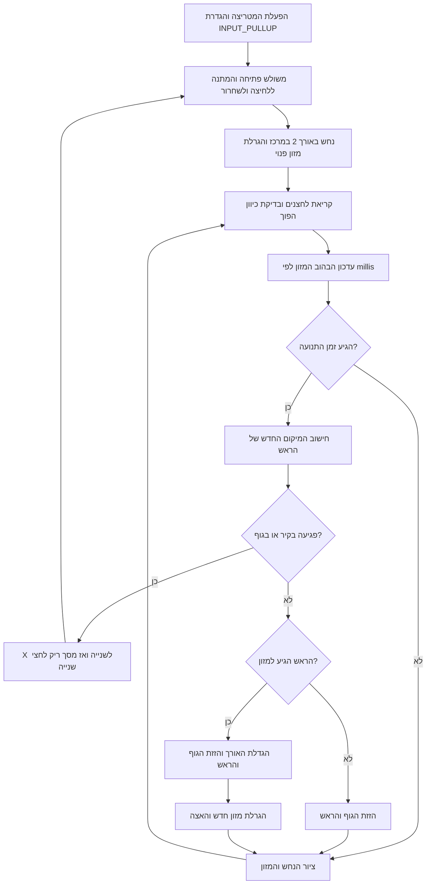

# משחק סנייק על Arduino Uno

פרויקט במסגרת **משימת הערכה בית ספרית 819283**: מערכת משחק אינטראקטיבית המשלבת Arduino Uno, מטריצת לדים 8×8, בקר MAX7219 וארבעה לחצני שליטה.

המשחק מדגים שילוב של קלט, תצוגה ולוגיקת משחק: הנחש נע על הלוח, אוסף מזון, גדל ומאיץ בהדרגה. התנגשות בקיר או בגוף הנחש מסיימת את הסיבוב ומפעילה אפקט חזותי, ולאחריו אפשר להתחיל משחק חדש.

[קוד המשחק המלא](snake_game/snake_game.ino) · [תוכנית בדיקות](TEST_PLAN.md) · [תיעוד והגשה](SUBMISSION.md)

## תכונות המשחק

- נחש באורך התחלתי של שני פיקסלים במרכז המטריצה.
- מזון מהבהב המוגרל במיקום שאינו חופף לגוף הנחש.
- שליטה בארבעה כיוונים ובדיקה המונעת בחירת כיוון הפוך לתנועה הנוכחית.
- גדילה בפיקסל אחד בכל אכילת מזון.
- האצה הדרגתית ממרווח תנועה של 700 מילישניות עד 300 מילישניות.
- זיהוי התנגשות בקירות ובגוף, הצגת X והתחלת סיבוב חדש.
- תזמון התנועה והבהוב המזון באמצעות `millis()`.

## רכיבי המערכת

| רכיב | תפקיד |
| --- | --- |
| Arduino Uno | קריאת הלחצנים, ניהול המשחק ושליחת נתונים לתצוגה |
| מודול MAX7219 | הפעלת מטריצת הלדים ושליטה בבהירות |
| מטריצת 1088AS בגודל 8×8 | הצגת הנחש, המזון ומסכי הפתיחה והסיום |
| ארבעה לחצני PBS-110-DC117 | ממשק קלט לשינוי כיוון התנועה |
| Breadboard וחוטי חיבור | חיבור הרכיבים למערכת אחת |
| כבל USB / סוללת 9V עם תקע לארדואינו | הזנת לוח הפיתוח |

## טבלת חיווטים

| רכיב | פין / אות | חיבור בארדואינו |
| --- | --- | --- |
| מודול MAX7219 | VCC | 5V |
| מודול MAX7219 | GND | GND |
| מודול MAX7219 | DIN | D11 |
| מודול MAX7219 | CLK | D13 |
| מודול MAX7219 | CS / LOAD | D10 |
| לחצן `UP_BUTTON` | רגל אחת | D2 |
| לחצן `DOWN_BUTTON` | רגל אחת | D3 |
| לחצן `RIGHT_BUTTON` | רגל אחת | D4 |
| לחצן `LEFT_BUTTON` | רגל אחת | D5 |
| כל ארבעת הלחצנים | הרגל השנייה | GND |

הלחצנים מוגדרים כ־`INPUT_PULLUP`: לחצן משוחרר נקרא `HIGH`, ולחצן לחוץ נקרא `LOW`. הנגדים הפנימיים בארדואינו משמשים לייצוב רמת הקלט במצב משוחרר. הפין A0 משמש בקוד לזריעת המחולל האקראי באמצעות `analogRead(A0)`.

הטבלה מתארת את החיבור למודול MAX7219 שעליו מחוברת המטריצה. מודול התצוגה מוזן מ־5V ובעל אדמה משותפת עם הארדואינו. סוללת 9V מתחברת לשקע ההזנה של הארדואינו, ולא ל־VCC של מודול התצוגה.

### מיפוי כיווני השליטה

המיפוי המוגדר ב־`waitForStart()` וב־`readButtons()` הוא:

| פין | שם המשתנה | כיוון לוגי במשחק |
| --- | --- | --- |
| D2 | `UP_BUTTON` | ימינה — `RIGHT` |
| D3 | `DOWN_BUTTON` | שמאלה — `LEFT` |
| D4 | `RIGHT_BUTTON` | למעלה — `UP` |
| D5 | `LEFT_BUTTON` | למטה — `DOWN` |

הציור משתמש ב־`MIRROR_X = true` לשיקוף ציר X. את סימון הלחצנים על המערכת יש להתאים לתנועה הנראית בפועל בהתאם לכיוון התקנת המטריצה.

## הוראות הפעלה ומשחק

1. מחברים את המערכת למקור מתח. על המטריצה מופיע משולש פתיחה.
2. לוחצים על אחד הלחצנים ומשחררים אותו כדי להתחיל סיבוב.
3. מכוונים את הנחש באמצעות ארבעת הלחצנים לעבר פיקסל המזון המהבהב.
4. בכל אכילת מזון הנחש גדל וקצב המשחק עולה.
5. יש להימנע מפגיעה בקירות הלוח ובגוף הנחש.
6. בסיום סיבוב מוצג X למשך שנייה, ולאחריו מסך ריק לחצי שנייה.
7. כאשר משולש הפתיחה חוזר, לחיצה ושחרור מתחילים סיבוב חדש.

## פתיחת הפרויקט ב־Arduino IDE

הקוד משתמש בספריית [LedControl של Eberhard Fahle](https://github.com/wayoda/LedControl). אפשר לשחזר את סביבת הפרויקט באמצעות גרסה 1.0.6 של הספרייה.

1. מורידים את המאגר באמצעות **Code → Download ZIP** ומחלצים אותו.
2. מתקינים את ספריית `LedControl` דרך מנהל הספריות ב־Arduino IDE.
3. פותחים את `snake_game/snake_game.ino`, בתוך התיקייה `snake_game`.
4. בוחרים **Arduino Uno** כלוח היעד ולוחצים **Verify**.
5. לצורך הפעלה על לוח אחר, בוחרים את הפורט המתאים ומעלים את הקוד.

הקובץ במאגר שומר על תוכן קוד המקור שנמסר מהפרויקט הפיזי.

### בנייה באמצעות Arduino CLI

```sh
arduino-cli core update-index
arduino-cli core install arduino:avr
arduino-cli lib install "LedControl@1.0.6"
arduino-cli compile --fqbn arduino:avr:uno snake_game
```

## מבנה המאגר

```text
arduino-snake-game/
├── README.md                   הסבר, חיווט והוראות הפעלה
├── TEST_PLAN.md                בדיקות למערכת ולמשחק
├── SUBMISSION.md               תיעוד הנדסי והשלמות להגשה
└── snake_game/
    └── snake_game.ino          קוד המשחק המלא
```

## מבנה הקוד

התוכנית מחולקת לפונקציות לפי תחומי האחריות של המערכת:

| פונקציה | תפקיד |
| --- | --- |
| `setup()` | הפעלת המטריצה, הגדרת הקלטים וזריעת המחולל האקראי |
| `showStart()` / `waitForStart()` | הצגת משולש והמתנה ללחיצה ולשחרור |
| `newGame()` | איפוס מיקום הנחש, אורכו, כיוונו ותזמוני המשחק |
| `readButtons()` | קריאת הלחצנים ובדיקת כיוון הפוך |
| `createFood()` | הגרלת מזון ובדיקת חפיפה עם גוף הנחש |
| `hitsSnake()` | בדיקת התנגשות בקואורדינטות הגוף |
| `moveSnake()` | עדכון התנועה, בדיקת התנגשויות, גדילה והאצה |
| `drawPixel()` / `drawGame()` | שיקוף הקואורדינטות וציור הנחש והמזון |
| `gameOverAnimation()` | הצגת אפקט סיום המשחק |
| `loop()` | שילוב קריאת הקלט, תזמון העדכונים וציור התצוגה |

הנחש נשמר בשני מערכים בגודל 64: `snakeX` ו־`snakeY`. אינדקס 0 מייצג את הראש, ושאר האינדקסים מייצגים את חוליות הגוף. לאחר חישוב המיקום החדש, הגוף מוזז מסוף המערך לכיוון הראש כדי לשמור על סדר החוליות.

### הגדרות מרכזיות

| הגדרה | ערך | משמעות |
| --- | --- | --- |
| `WIDTH`, `HEIGHT` | 8 | גודל הלוח |
| `MAX_LENGTH` | 64 | גודל מערכי הנחש |
| `moveDelay` בתחילת סיבוב | 700ms | מרווח בין צעדי תנועה |
| `SPEED_INCREASE` | 30ms | קיצור המרווח לאחר אכילה |
| `MIN_SPEED` | 300ms | מרווח התנועה המינימלי |
| `blinkDelay` | 300ms | מרווח שינוי הנראות של המזון |
| `setIntensity()` | 5 | הגדרת בהירות התצוגה בטווח 0–15 |
| `MIRROR_X` | `true` | שיקוף ציר X בזמן הציור |

## תרשים זרימה לוגי



## מקורות

- [Arduino Uno — תיעוד היצרן](https://docs.arduino.cc/hardware/uno-rev3/).
- [MAX7219/MAX7221 — דף הנתונים של Analog Devices](https://www.analog.com/media/en/technical-documentation/data-sheets/MAX7219-MAX7221.pdf).
- [1088AS — דף נתונים לדגם המטריצה](https://www.hwkitchen.cz/user/related_files/1088as-8x8-led-matrix-datasheet-pdf.pdf).
- [PBS — דף נתונים לסדרת לחצנים](https://www.canal.com.tw/archive/product/Push/PBS-spec.pdf).
- [LedControl — ספריית התצוגה](https://github.com/wayoda/LedControl).

מידע על התיעוד ההנדסי, גילוי נאות על שימוש ב־AI והכנה להגשה מופיע ב־[SUBMISSION.md](SUBMISSION.md).
